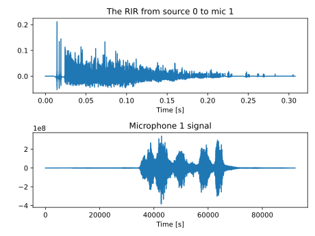

# RIR 仿真

## 学习目标

至少掌握一种RIR仿真软件的使用方法

## RIR工具 - RIR-Generator

镜像声源法，是一种由Allen 和 Berkeley[1] 在1979年提出的算法。经常用于各种声学信号处理任务中，来生成房间冲击响应。

RIR-Generator 实现了一个 mex 函数，可以在 MATLAB 中使用，可以使用镜像生源法生成多通道房间冲击响应。

更多的信息可以查看[这里](https://www.audiolabs-erlangen.de/fau/professor/habets/software/rir-generator).

[1] J.B. Allen and D.A. Berkley, "Image method for efficiently simulating small-room acoustics," Journal Acoustic Society of America, 65(4), April 1979, p 943.

### 实验设置

- 读入一段音频，听测效果
- 绘制房间冲击响应

### 代码

```matlab
c = 340;                     % Sound velocity (m/s)
fs = 16000;                  % Sample frequency (samples/s)
r = [ 2 1.5 2 ];             % Receiver position [ x y z ] (m)
s = [ 2 3.5 2 ];             % Source position [ x y z ] (m)
L = [ 5 4 6 ];               % Room dimensions [ x y z ] (m)
beta = 0 . 4;                % Reverberationtime (s)
nsample = 4096;              % Number of samples
mtype = ’ hypercardioid ’;   % Type of microphone
order = −1;                  % −1 equals maximum reflection order!
dim = 3;                     % Room dimension
orientation = [pi/2 0];      % Microphone orientation [azimuth elevation] in radians
hp_filter = 1;               % Enable high-pass filter

h = rir_generator(c, fs, r, s, L, beta, nsample, mtype, order, dim, orientation, hp_filter);
```

- 输入:
  - c: 声速
  - fs: 采样频率
  - r: 麦克风三维坐标
  - s: 声源坐标
  - L: 房间大小
  - beta: 混响时间 T60 或 1 x 6 向量表示 6 面墙的反射系数
  - nsample: 样本点数(冲击响应长度), 默认是 T60 * fs
  - mtype: 麦克风类型(全向，亚心形，心形，超心形，双向，默认为全向)
  - order: 反射顺序，默认为-1，即最大顺序
  - dim: 房间维数，默认3
  - orientation: 麦克风指向的方向，指定方位角和仰角（以弧度为单位），默认为 [0 0]
  - hp_filter: 即高通滤波器，使用 'false' 禁用高通滤波器，默认启用
- 输出参数:
  - h: M x nsample 矩阵包含计算出的房间脉冲响应
  - beta_hat: 如果混响时间被指定为输入参数，返回对应的反射系数

### 实验效果


主观听测，可以实现加混响的效果

## RIR工具 - pyroomacoustics

使用的是镜像声源法来实现语音加混响，使用[pyroomacoustics](https://pyroomacoustics.readthedocs.io/en/pypi-release/pyroomacoustics.room.html) Room Simulation 模块，功能与 RIR-Generator类似，功能更加强大，可以设定不同墙壁表面的材质，以及常用的麦克风阵列，具体见测试代码。

### 实验设置

- 读入一段音频，听测效果
- 绘制房间冲击响应

### 代码

```python
# -*- coding:utf-8 -*-
import numpy as np
import matplotlib.pyplot as plt
import pyroomacoustics as pra
from scipy.io import wavfile

# The desired reverberation time and dimensions of the room
rt60_tgt = 0.3  # seconds
room_dim = [10, 7.5, 3.5]  # meters

# import a mono wavfile as the source signal
# the sampling frequency should match that of the room
fs, audio = wavfile.read("speech.wav")

# Create the room
room = pra.ShoeBox(
    room_dim, fs=fs, materials=pra.Material('hard_surface'), max_order=10
)

# place the source in the room
room.add_source([2.5, 3.73, 1.76], signal=audio, delay=0.5)

# define the locations of the microphones
mic_locs = np.c_[
    [6.3, 4.87, 1.2], [6.3, 4.93, 1.2],  # mic 1  # mic 2
]

# finally place the array in the room
room.add_microphone_array(mic_locs)

fig, ax = room.plot()
ax.set_xlim([-1, 10])
ax.set_ylim([-1, 10])
ax.set_zlim([-1, 4])
fig.show()
fig.savefig('room.svg')

room.image_source_model()
fig, ax = room.plot(img_order=2)
# fig.set_size_inches(18.5, 10.5)
fig.show()
fig.savefig('image.svg')

# Run the simulation (this will also build the RIR automatically)
room.simulate()

room.mic_array.to_wav(
    f"speech_rev.wav",
    norm=True,
    bitdepth=np.int16,
)

# measure the reverberation time
rt60 = room.measure_rt60()
print("The desired RT60 was {}".format(rt60_tgt))
print("The measured RT60 is {}".format(rt60[1, 0]))

# Create a plot
plt.figure()

# plot one of the RIR. both can also be plotted using room.plot_rir()
rir_1_0 = room.rir[1][0]
plt.subplot(2, 1, 1)
plt.plot(np.arange(len(rir_1_0)) / room.fs, rir_1_0)
plt.title("The RIR from source 0 to mic 1")
plt.xlabel("Time [s]")

# plot signal at microphone 1
plt.subplot(2, 1, 2)
plt.plot(room.mic_array.signals[1, :])
plt.title("Microphone 1 signal")
plt.xlabel("Time [s]")

plt.tight_layout()
plt.show()
plt.savefig('rir.svg')
```

### 实验效果

房间拓扑结构，×是麦克风和·是声源


镜像声源法，




主观听测，可以实现加混响的效果，输出语音有明显空间感。
