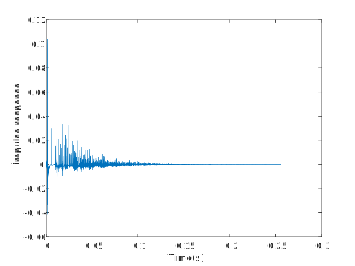
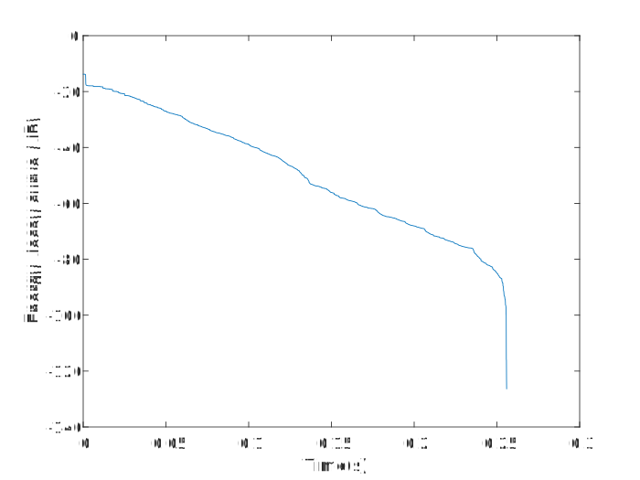
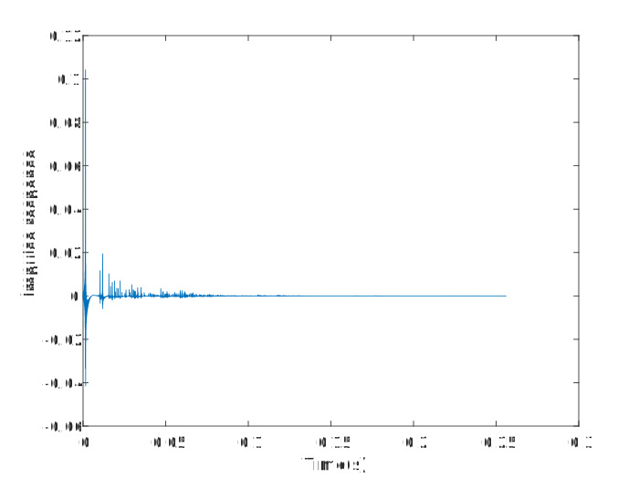
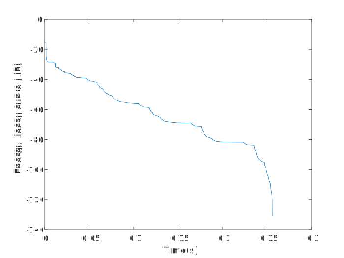

# 混响时间计算

## 学习目标

计算房间混响时间，至少设计2种房间进行计算.

## 实验设置

使用 RIR-Generator 生成2个房间的 rir，幅度的平方的后向积分，得到edc曲线，观察混响时间与设定时间是否一致。

## 代码

全部代码及测试数据：https://github.com/RRRRwys/dasp-homework

```matlab
clear; close all; clc;
c = 340;               
fs = 16000;              
r = [2 1.5 2];         
s = [2 2 2];           
% L = [5 4 3];
L = [10 5 5];              
beta = 0.25;               % 混响时间
n = 4096;               
h = rir_generator(c, fs, r, s, L, beta, n);

t = [0:length(h)-1]./fs;
figure(1);
plot(t,h);
xlabel('Time(s)');
ylabel('Impulse response');

% 计算 edc
edc = zeros(1,length(h));
for i = [length(h)-1:-1:1]
    edc(i) = edc(i+1) + h(i) * h(i);
end
edc = 10 * log10(edc);
figure(2);
plot(t,edc);
xlabel('Time(s)');
ylabel('Energy decay curve (dB)');
```

## 实验结果

room1: 5m, 4m, 3m





room2: 10m 5m 5m





观察可以发现混响时间与设定值基本一致

