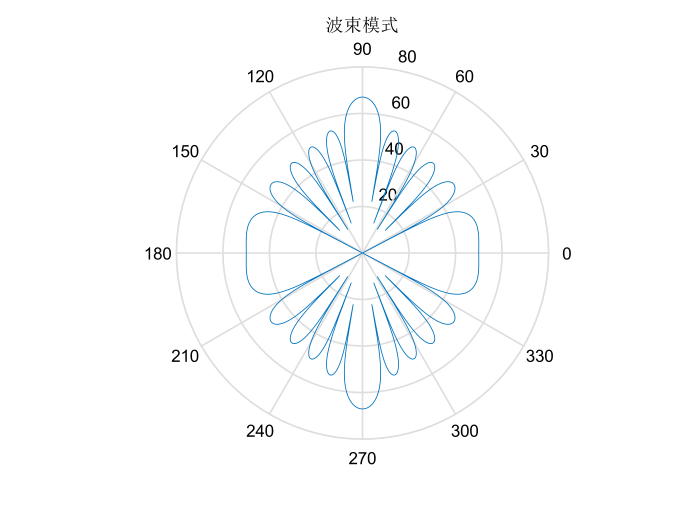
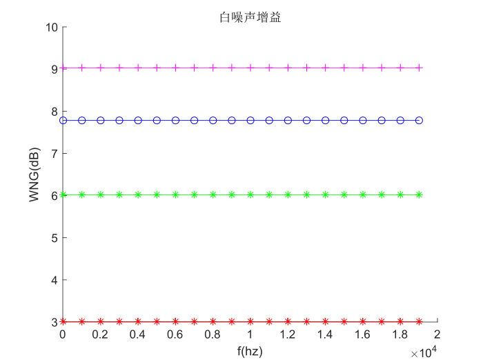

# 固定波束

## 学习目标

仿真实验: 用RIR仿真生成数据，设计固定波束验证去混响的效果，绘制指向因子和白噪声增益图；
实测波束: 利用真实麦克风阵列数据，分析不同麦克风数量和目标方位对设计波束的增强结果的影响。

## 实验设置

仿真实验：
- 使用rir_generator生成数据
- 8 mic 均匀线阵，间距 3cm
- 延迟相加波束
- 目标方向与线阵垂直
- 主观听测去混响效果，pesq
- 绘制波束模式、指向因子、白噪声增益

实测数据：
- 采用实测数据
- 阵列拓扑结构与仿真实验一致
- 调整麦克数量，目标方向角度
- 主观听测效果, pesq

## 代码

## 实验结果

主观听测，有一定的效果

