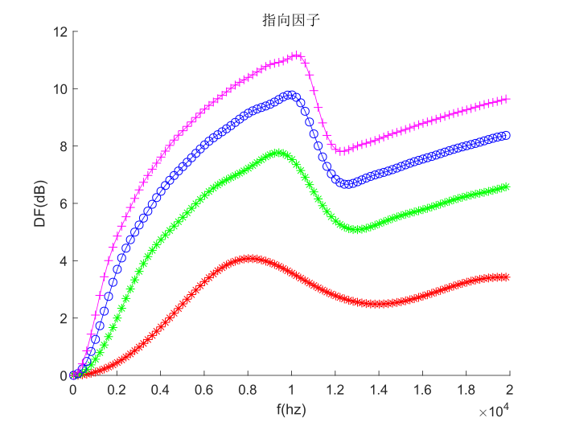

# 固定波束

## 学习目标

仿真实验: 用RIR仿真生成数据，设计固定波束验证去混响的效果，绘制指向因子和白噪声增益图；
实测波束: 利用真实麦克风阵列数据，分析不同麦克风数量和目标方位对设计波束的增强结果的影响。

## 实验设置

1. 使用rir_generator生成数据
2. 8 mic 均匀线阵，间距 3cm
3. 延迟相加波束
4. 目标方向与线阵垂直

## 实验内容

1. 声源与阵列垂直，主观听测去混响效果，pesq
2. 声源与阵列共线，主观听测去混响效果，pesq
3. 声源与阵列垂直，麦克风数量减少为4个，主观听测去混响效果，pesq
4. 绘制波束模式、指向因子、白噪声增益

## 代码

全部代码及测试数据：https://github.com/RRRRwys/dasp-homework

- cal_pesq.py : 用于计算 pesq 取值
```python
from scipy.io import wavfile
from pesq import pesq
def cal_pesq(f1,f2):
    rate, ref = wavfile.read(f1)
    rate, deg = wavfile.read(f2)
    print(f1,f2)
    print('wb', pesq(rate, ref, deg, 'wb')) # 宽带pesq
    print('nb', pesq(rate, ref, deg, 'nb'))

cal_pesq('./speech.wav', './speech_rev_ds_90_4.wav')
```

- dir_vec.m : 计算导向矢量
```matlab
function dfc = dir_vec(f, tar_angle, angle, M, dis, c)
% 计算均匀线阵导向矢量
% Input:
%   f 频率 Hz
%   angle 目标方向 弧度
%   M 麦克风数量
%   dis 间距 m
%   c 声速 m/s
% Output:
%   dfc 导向矢量
 
dfc = zeros(M,1);
dt = dis / c;
cosd = cos(angle+pi/2-tar_angle);
for p = 1:M
    dfc(p) = exp(-1i*2*pi*f*dt*(p-1)*cosd);
end
end
```

- fix_beam_DS.m : 延迟相加波束计算波束模式，指向因子，白噪声增益
```matlab
clc;close all;clear;

%%%%%%%%%%%%%%%%%%%%%%%%%%%%%%%%%%%%%%%%%%%%%%%%%%%%%%%%%%%%%%%%%%%%%%%%%%%

% dir_vec

M = 8;
f = 8000;
dis = 0.03;
c = 340;
tar_angle = pi/2;

angles = 0: pi/1000 : pi*2.0;
g = zeros(length(angles),1);

for i = 1:length(angles)
    angle = angles(i);
    dirv = dir_vec(f, tar_angle, angle, M, dis, c);
    h = dirv;
    g(i) = abs(sum(h))/M;
end

figure
polar(angles', 20*log10(g) - min(20*log10(g)));
title('波束模式');

%%%%%%%%%%%%%%%%%%%%%%%%%%%%%%%%%%%%%%%%%%%%%%%%%%%%%%%%%%%%%%%%%%%%%%%%%%%

fq = 20:1000:20000;
wng = zeros(4,length(i));
for i = 1:length(fq)
    f = fq(i);
    d = dir_vec(f, tar_angle, tar_angle, 2, dis, c);
    h = d/2;
    wng(1,i) = abs(h'*d)^2/(h'*h);
    
    d = dir_vec(f, tar_angle, tar_angle, 4, dis, c);
    h = d/4;
    wng(2,i) = abs(h'*d)^2/(h'*h);
    
    d = dir_vec(f, tar_angle, tar_angle, 6, dis, c);
    h = d/6;
    wng(3,i) = abs(h'*d)^2/(h'*h);
    
    d = dir_vec(f, tar_angle, tar_angle, 8, dis, c);
    h = d/8;
    wng(4,i) = abs(h'*d)^2/(h'*h);
end

figure;
hold on;
plot(fq, 10*log10(wng(1,:)),'-r*');
hold on;
plot(fq, 10*log10(wng(2,:)),'-g*');
hold on;
plot(fq, 10*log10(wng(3,:)),'-bo');
hold on;
plot(fq, 10*log10(wng(4,:)),'-m+');
hold on;
ylabel('WNG(dB)');
xlabel('f(hz)')
title('白噪声增益');

%%%%%%%%%%%%%%%%%%%%%%%%%%%%%%%%%%%%%%%%%%%%%%%%%%%%%%%%%%%%%%%%%%%%%%%%%%%

% 指向因子 DF

fq = 20:200:20000;
DF = zeros(4,length(i));
for i = 1:length(fq)
    f = fq(i);
    
    M = 2;
    gama = zeros(M);
    dt = dis/c;
    for ii = 1:M
        for jj = 1:M
            if(ii ~= jj)
                gama(ii,jj) = sin(2*pi*f*(jj-ii)*dt)/(2*pi*f*(jj-ii)*dt);
            else
                gama(ii,jj) = 1.0;
            end
        end
    end
    d = dir_vec(f, tar_angle, tar_angle, M, dis, c);
    h = d/M;
    DF(1,i) = abs(h'*d)^2/(h'*gama*h);
    
    M = 4;
    gama = zeros(M);
    dt = dis/c;
    for ii = 1:M
        for jj = 1:M
            if(ii ~= jj)
                gama(ii,jj) = sin(2*pi*f*(jj-ii)*dt)/(2*pi*f*(jj-ii)*dt);
            else
                gama(ii,jj) = 1.0;
            end
        end
    end
    d = dir_vec(f, tar_angle, tar_angle, M, dis, c);
    h = d/M;
    DF(2,i) = abs(h'*d)^2/(h'*gama*h);
    
    M = 6;
    gama = zeros(M);
    dt = dis/c;
    for ii = 1:M
        for jj = 1:M
            if(ii ~= jj)
                gama(ii,jj) = sin(2*pi*f*(jj-ii)*dt)/(2*pi*f*(jj-ii)*dt);
            else
                gama(ii,jj) = 1.0;
            end
        end
    end
    d = dir_vec(f, tar_angle, tar_angle, M, dis, c);
    h = d/M;
    DF(3,i) = abs(h'*d)^2/(h'*gama*h);
    
    M = 8;
    gama = zeros(M);
    dt = dis/c;
    for ii = 1:M
        for jj = 1:M
            if(ii ~= jj)
                gama(ii,jj) = sin(2*pi*f*(jj-ii)*dt)/(2*pi*f*(jj-ii)*dt);
            else
                gama(ii,jj) = 1.0;
            end
        end
    end
    d = dir_vec(f, tar_angle, tar_angle, M, dis, c);
    h = d/M;
    DF(4,i) = abs(h'*d)^2/(h'*gama*h);
end

figure;
hold on;
plot(fq, 10*log10(abs(DF(1,:))),'-r*');
hold on;
plot(fq, 10*log10(abs(DF(2,:))),'-g*');
hold on;
plot(fq, 10*log10(abs(DF(3,:))),'-bo');
hold on;
plot(fq, 10*log10(abs(DF(4,:))),'-m+');
hold on;
ylabel('DF(dB)');
xlabel('f(hz)')
title('指向因子');

%%%%%%%%%%%%%%%%%%%%%%%%%%%%%%%%%%%%%%%%%%%%%%%%%%%%%%%%%%%%%%%%%%%%%%%%%%%

```

- cancel_rev.m : 基于阵列实现延迟相加波束，观察其对于去混响的影响
```matlab
clear; close all; clc;

% postion
c = 340;               
fs = 16000;
% M = 8; % number of mic
M = 4;
r = [
     %2.00 1.5 2; 
     %2.03 1.5 2; 
     2.06 1.5 2; 
     2.09 1.5 2; 
     2.12 1.5 2; 
     2.15 1.5 2; 
     %2.18 1.5 2; 
     %2.21 1.5 2
     ];         

s = [2.105 2 2]; % 90
% s = [2.71 1.5 2]; % 0

tar_angle = pi/2;

L = [5 4 3];
beta = 0.69;
n = 4096;
h = rir_generator(c, fs, r, s, L, beta, n);

[x,fs] = audioread('speech.wav');
y = [];
for i = 1:M
    tmp = filter(h(i,:),[1.],x);
    filename = sprintf('speech_rev_%d_90_4.wav',i);
    audiowrite(filename, tmp, fs);
    y = [y ; tmp'];
end

% pi / 2
y1 = zeros(1,length(y(1,:)));
for i = 1:M
    y1 = y1 + y(i,:);
end

filename = 'speech_rev_ds_90_4.wav';
audiowrite(filename, y1, fs);

```

## 实验结果

1. 声源与阵列垂直，主观听测去混响效果，pesq

- 主观听测，有一定的效果；
- pesq 测试结果如下，可以看到pesq有了明显提升；

音频 | 宽带 pesq
:-:|:-:
channel1 带混响 | 1.961
channel2 带混响 | 1.999
channel3 带混响 | 1.975
channel4 带混响 | 1.882
channel5 带混响 | 1.913
channel6 带混响 | 1.989
channel7 带混响 | 1.989
channel8 带混响 | 1.965
**DS波束 去混响** | **2.301**

2. 声源与阵列共线，主观听测去混响效果，pesq

- 主观听测，效果不好，混响甚至更严重了；
- pesq 测试结果如下，可以看到pesq出现下降；

音频 | 宽带 pesq
:-:|:-:
channel1 带混响 | 1.716
channel2 带混响 | 1.708
channel3 带混响 | 1.702
channel4 带混响 | 1.698
channel5 带混响 | 1.696
channel6 带混响 | 1.777
channel7 带混响 | 1.752
channel8 带混响 | 1.760
**DS波束 去混响** | **1.635**

3. 声源与阵列垂直，麦克风数量减少为2和4，主观听测去混响效果，pesq

- 去除了2侧的个2个mic，保留中间 4 个

- 主观听测，效果没有明显下降；
- pesq 测试结果如下，可以看到pesq相对去混响前有一定提升，但是比 8mic 时，效果有一定下降；

音频 | 宽带 pesq
:-:|:-:
channel1 带混响 | 1.975
channel2 带混响 | 1.882
channel3 带混响 | 1.913
channel4 带混响 | 1.989
**DS波束 去混响** | **2.112**

4. 绘制波束模式、指向因子、白噪声增益



