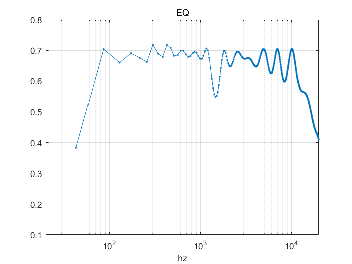
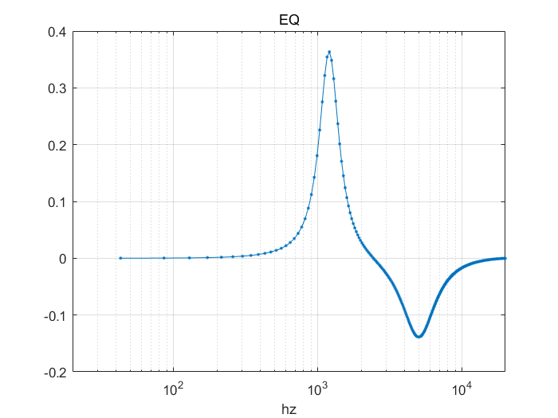
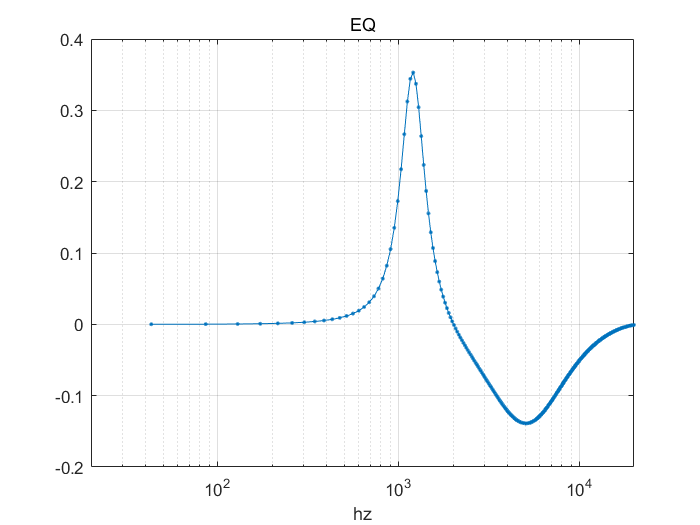
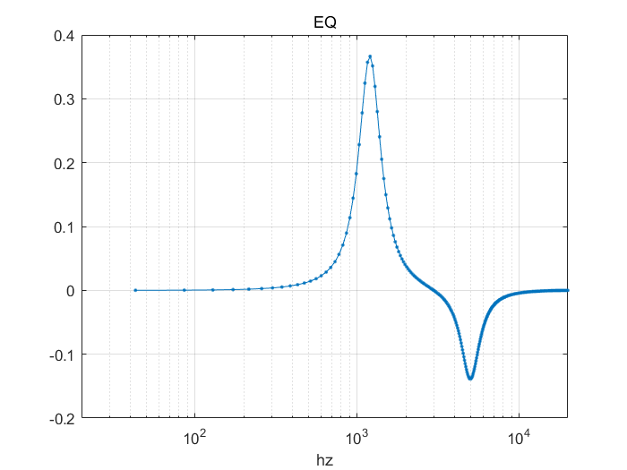
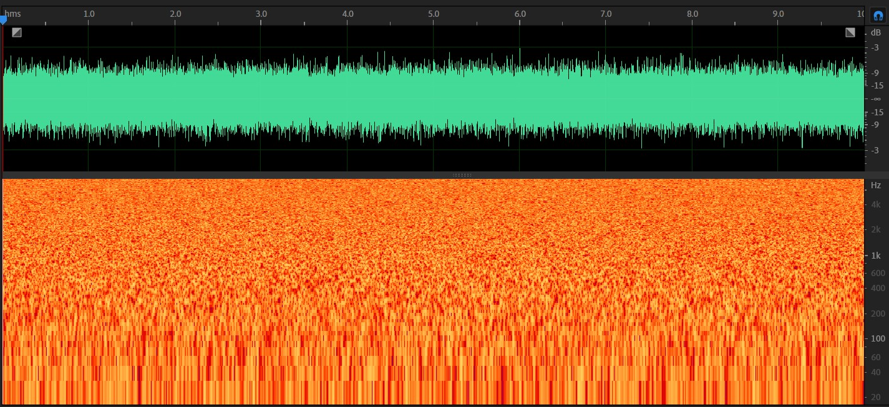
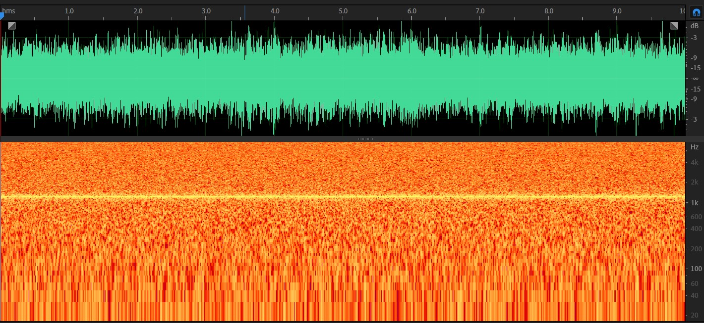

# 均衡器设计

## 实验目标

设计一个均衡器

## 实验设置

- 采用参数滤波器的峰值滤波器，通过组合他们得到均衡器。
- 可调节的频点为(Hz): 55, 77, 110, 156, 220, 311, 440, 622, 880, 1200, 1800, 2500, 3500, 5000, 7000, 10000, 14000, 20000
- 输入每个频点的期望增益
- 调节每个频点的Q值，影响’胖瘦‘
1. 绘制频响曲线
2. 输入白噪声信号，观察输出信号语谱图

## 代码

全部代码及测试数据：https://github.com/RRRRwys/dasp-homework

- EQ.m 
```matlab
function y = EQ(gain,Qs,fs,x)

% 采用参数滤波器的峰值滤波器，通过组合他们得到均衡器
% F0 中包含所有可调的频点，是一个长度为 18 的数组
% Input:
%   gain：标记每个频点的增益。是一个长度为 18 的数组，对应 F0 中的频点，单位是 dB，缺省为 0
%   Qs: 是每个频点的 Q 值，Q值越大，调节越精确，影响范围越窄，缺省参数见代码
%   fs: 是采样频率，单位是Hz，缺省为 44100 Hz
%   x: 是输入的信号，缺省为空
% Output:
%   y: 是输入信号经过给定均衡器的输出
%   调用本函数后会绘制，当前均衡器的频响曲线

F0 = [55, 77, 110, 156, 220, 311,440,622,880,1200,1800,2500,3500,5000,7000,10000,14000,20000];
numF = length(F0);
length(gain);

if (nargin <= 3)
    x = [];
end
if (nargin <= 2)
    fs = 44100;
end
if (nargin <= 1)
    % Qs = [0.7,0.7,0.7, 0.7, 0.7, 0.7,0.7,0.7,0.7,0.7, 0.7, 0.7, 0.7, 0.7, 0.7, 0.7,  0.7,  0.7];
    Qs = [1.707,1.707,1.707, 1.707, 1.707, 1.707,1.707,1.707,1.707,1.707, 1.707, 1.707, 1.707, 1.707-0.1, 1.707-0.2, 1.707-0.4,  1.707-0.8,  1.707-1.0];
end
if (nargin <= 0)
    gain = zeros(numF,1);
end


% gain(10) = 5;
% gain(15) = -5;
% Qs(10) = 10.1;
% Qs(15) = 10.3;

numerator_B = zeros(numF,3);
denominator_A = zeros(numF,3);

for i = 1:numF
    dBgain = gain(i);
    f0 = F0(i);
    Q = Qs(i);
    A  = sqrt( 10^(dBgain/20) );
    w0 = 2*pi*f0/fs;
    alpha = sin(w0)/(2*Q);
    
    b0 =   1 + alpha*A;
    b1 =  -2*cos(w0);
    b2 =   1 - alpha*A;
    a0 =   1 + alpha/A;
    a1 =  -2*cos(w0);
    a2 =   1 - alpha/A;
    numerator_B(i,:) =  [b0,b1,b2]/a0;
    denominator_A(i,:) = [a0,a1,a2]/a0;
end

if(~isempty(x))
    y = zeros(length(x),1);
    for i = 1:numF
        y = y + filter(numerator_B(i,:), denominator_A(i,:),x);
    end
    y = y / length(F0);
end

% plot 

N = 512;
H = zeros(N);
W = [];
for i = 1:numF
    [tmpH,W] = freqz(numerator_B(i,:),denominator_A(i,:),N);
    H = H + tmpH;
end

H = H / numF;

figure;
plot(W/(2*pi),20*log10(abs(H)),'.-'); title('EQ');

figure;
semilogx(W/(2*pi)*fs,20*log10(abs(H)),'.-'); 
xlabel('hz');
xlim([20 20000]);
grid on;
title('EQ');

end

```

- test.m 
```matlab
clc;clear;clc;
g = zeros(18,1);
Qs = [0.5577,2.4277,1.707, 2.00636, 1.41075, 1.707,1.607,1.35183,1.407,1.97973, 2.0977, 1.43421, 1.207, 1.66776, 1.88196, 1.4267,  0.53541,  0.25372]; % Q越大，对应的峰值越瘦

%for i = 1:18
%    g(i) = 5;
%end

g(10) = 50;
Qs(10) = Qs(10) * 2;

[x,fs] = audioread('wnoise.wav');

y = EQ(g,Qs,fs,x);
audiowrite('eq_output.wav',y,fs);
```

## 实验结果

1. 绘制频响曲线

- 增益全部拉为相同大小，可以看到频响有比较明显的抖动


- 拉高1200Hz，降低5000Hz


- 拉高1200Hz，降低5000Hz，降5000Hz处的Q值除2


- 拉高1200Hz，降低5000Hz，降5000Hz处的Q值乘2


2. 输入白噪声信号，观察输出信号语谱图

- 白噪声

- 拉高1200Hz的白噪声信号


