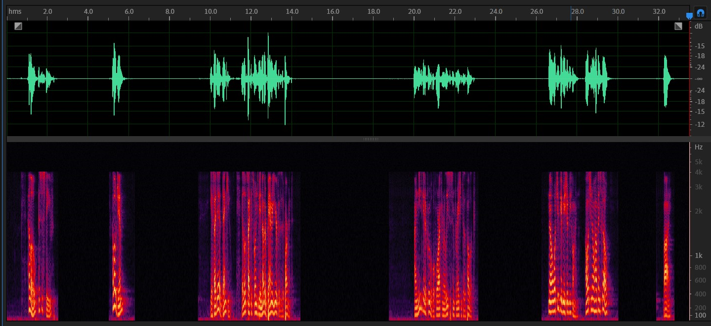
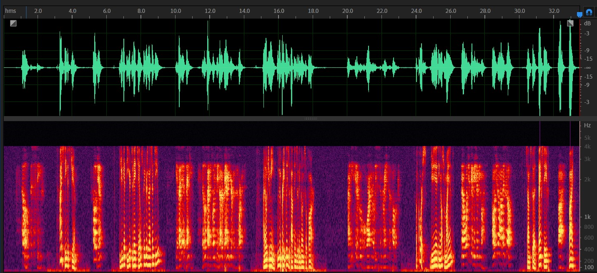
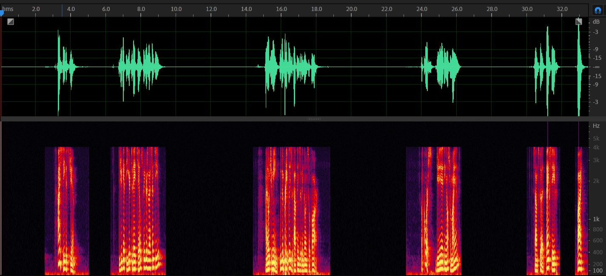
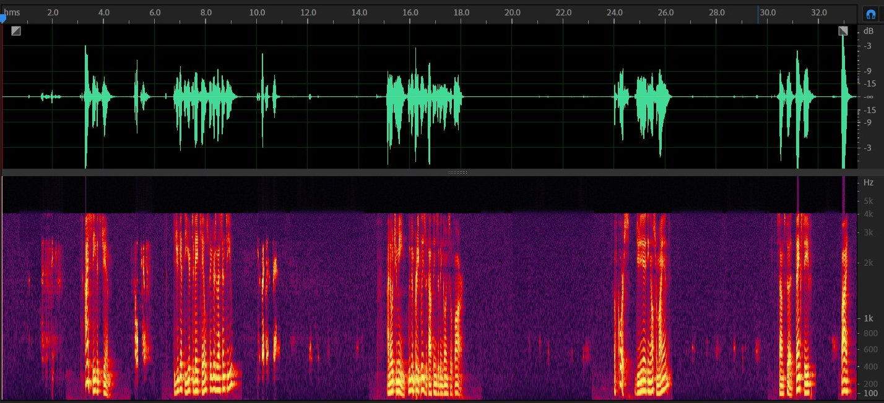

# AEC

## 实验目标

研究WebRTC的AEC模块， 用RIR仿真生成数据，用于AEC。

## 实验设置

- RIR仿真数据，采用一段 2 人对话的音频
- ref.wav = 远端语音
- rec.wav = (远端语音 + rir) + 近端语音+噪声
- AEC 模块使用，VS 编译生成 demo.exe，直接调用进行回声消除
```bash
./demo.exe ./ref.wav ./rec.wav output.wav
```

1. 主观听测
2. 观察波形、语谱图
4. pesq

## 实验结果

1. 主观听测

- 回声消除效果比较明显，但仍有部分残余；

2. 观察波形、语谱图

- 可以发现，AEC输出信号与实际近端信号基本一致，回声消除效果比较明显

- ref.wav 远端信号
  

- rec.wav (远端语音 + rir) + 近端语音
  

- 近端实际信号
  

- output.wav AEC之后的输出
  

3. pesq

   参考信号是近端语音，计算pesq取值，结果如下。可以看到AEC明线提高了pesq，语音质量提升。

   | 音频                                     | pesq  |
   | ---------------------------------------- | ----- |
   | rec.wav (远端语音 + rir) + 近端语音+噪声 | 2.261 |
   | output.wav 输出信号                      | 3.054 |

   

